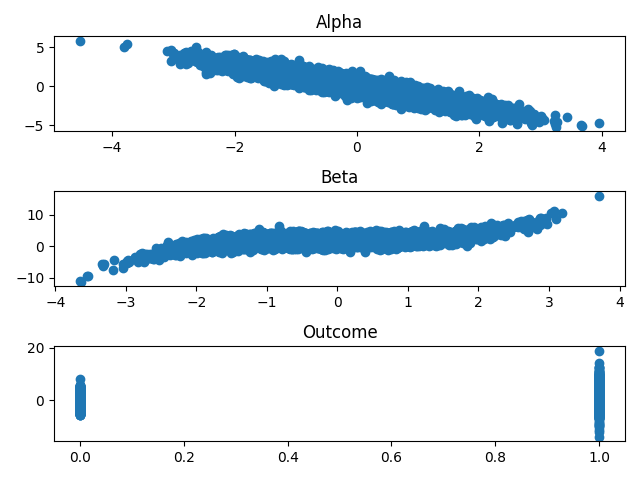
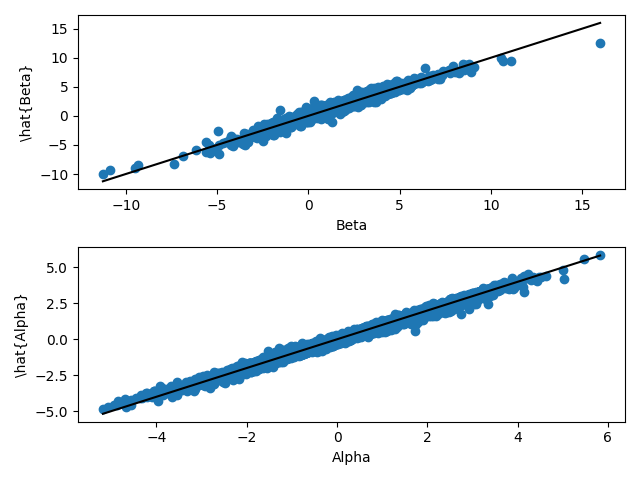

# Table of Contents

Install [PyTorch](https://pytorch.org) and [matplotlib](https://matplotlib.org). Then:

    import torch
    import matplotlib.pyplot as plt
    
    torch.manual_seed(3005)
    # In practice, this seed may not be enough to get reproducible results.

Simulate data from the generating process:

    n, dimension_x, dimension_theta = 10000, 5, 2
    x = torch.randn(n, dimension_x)
    # model parameters: theta = (alpha, beta)
    alpha = 1/5 * x[:, 0] - 4/3 * x[:, 1] - 1/2 * x[:, 2]
    beta = 2 - x[:, 1] + 1/4 * x[:, 0] ** 3
    treatment = 1 * (torch.randn(n) > 0)
    epsilon = torch.randn(n)
    y = alpha + beta * treatment + epsilon

Visualize parameters:

    fig, ax = plt.subplots(nrows = 3, ncols = 1)
    ax[0].scatter(x[:, 1], alpha)
    ax[0].set_title("Alpha")
    ax[1].scatter(x[:, 0], beta)
    ax[1].set_title("Beta")
    ax[2].scatter(treatment, y)
    ax[2].set_title("Outcome")
    fig.tight_layout()

Estimate parameters using a multi-layer perceptron (MLP):

    # Define MLP for estimating parameters
    model = torch.nn.Sequential(
        torch.nn.Linear(dimension_x, 20),
        torch.nn.ReLU(),
        torch.nn.Linear(20, 20),
        torch.nn.ReLU(),
        torch.nn.Linear(20, dimension_theta)
    )
    optimizer = torch.optim.Adam(model.parameters())
    mse_loss = torch.nn.MSELoss()
    
    # Estimate parameters
    model.train() # set model to training mode
    for epoch in range(5000):
        # Calculate loss function
        theta = model(x)
        pred = theta[:, 0] + theta[:, 1] * treatment
        loss = mse_loss(pred, y)
        # Backpropagation
        optimizer.zero_grad()
        loss.backward()
        optimizer.step()
        if epoch % 100 == 0:
            print(f"Train Loss: {loss.item(): >8f}")
    
    message = f"Train Loss: {loss.item(): >8f}"
    message

    Train Loss: 0.942023

Plot estimates:

    alpha_hat, beta_hat = theta[:, 0].detach().numpy(), theta[:, 1].detach().numpy()
    alpha_true, beta_true = alpha.detach().numpy(), beta.detach().numpy()
    fig, ax = plt.subplots(nrows = 2, ncols = 1)
    ax[0].scatter(beta_true, beta_hat)
    ax[0].plot([beta_true.min(), beta_true.max()], [beta_true.min(), beta_true.max()], color = "black")
    ax[0].set_xlabel("Beta")
    ax[0].set_ylabel("\hat{Beta}")
    ax[1].scatter(alpha_true, alpha_hat)
    ax[1].plot([alpha_true.min(), alpha_true.max()], [alpha_true.min(), alpha_true.max()], color = "black")
    ax[1].set_xlabel("Alpha")
    ax[1].set_ylabel("\hat{Alpha}")
    fig.tight_layout()

Inference requires a few components: derivative of loss function, hessian of the loss function, and the derivative of a smooth function of interest.
First, calculate the gradient of the loss function with respect to the structural model parameters:

    theta = model(x)
    theta.retain_grad()
    pred = theta[:, 0] + theta[:, 1] * treatment
    
    # Manual calculation of derivative of loss function wrt alpha and beta, evaluated at each x
    gradient_manual = torch.cat(
        (
            (-2*(y - pred)).reshape(n, 1), # (del loss / del alpha)(x_i)
            (-2*treatment*(y - pred)).reshape(n, 1) # (del loss / del beta)(x_i)
        ),
        dim = 1
    )
    
    # Notice that theta is evaluated for each x_i, in fact we have theta(x_i)
    # But now we want the derivative of loss_i wrt to alpha and beta
    loss = torch.nn.MSELoss(reduction = "none")(pred, y).sum() # sum across all x_i
    # Derivative of the sum wrt to each theta_i, line by line
    gradient_auto = torch.autograd.grad(loss, theta, create_graph = True, retain_graph = True)[0]
    
    # Check if calculations match
    assert (gradient_manual == gradient_auto).all().item()
    
    gradient_auto

    tensor([[ 2.3064,  2.3064],
            [ 0.4651,  0.4651],
            [-1.5842,  0.0000],
            ...,
            [-1.1026,  0.0000],
            [ 1.0910,  0.0000],
            [ 1.9622,  1.9622]], grad_fn=<AddBackward0>)

Second, calculate hessian of the loss function:

    # Manual calculation
    hessian_manual = torch.zeros(dimension_theta, dimension_theta)
    hessian_manual[0, 0] = 2.0
    hessian_manual[0, 1] = (2.0 * treatment).mean()
    hessian_manual[1, 0] = (2.0 * treatment).mean()
    hessian_manual[1, 1] = (2.0 * treatment ** 2.0).mean()
    
    # Automatic differentiation
    hessian_auto = torch.zeros(dimension_theta, dimension_theta)
    # Derivative of the "derivative of the loss function wrt to theta_1"  with respect to each theta_i
    hessian_auto[0, :] = torch.autograd.grad(gradient_auto.sum(0)[0], theta, create_graph = True, retain_graph = True)[0].mean(0)
    # Derivative of the "derivative of the loss function wrt to theta_2"  with respect to each theta_i
    hessian_auto[1, :] = torch.autograd.grad(gradient_auto.sum(0)[1], theta, create_graph = True, retain_graph = True)[0].mean(0)
    
    # Check if calculations match
    assert (hessian_manual == hessian_auto).all().item()
    
    hessian_auto

    tensor([[2.0000, 0.9960],
            [0.9960, 0.9960]])

Third, calculate the derivative of the smooth function of interest, here called &ldquo;H&rdquo;:

    # Inference on average treatement effect, mu = E[H(...)] = E[beta(x)|X=x]
    H = theta[:, 1]
    H_gradient = torch.autograd.grad(H.sum(), theta, create_graph = True, retain_graph = True)[0]
    H_gradient

    tensor([[0., 1.],
            [0., 1.],
            [0., 1.],
            ...,
            [0., 1.],
            [0., 1.],
            [0., 1.]])

Combine all the objects above to estimate the influence function:

    # Invert Hessian
    lambda_inverse = torch.linalg.solve(hessian_auto, torch.eye(dimension_theta))
    
    # Calculate influence function
    adjustment = H_gradient.mm(lambda_inverse).mm(gradient_auto.T).diag()
    psi = H - adjustment
    
    psi

    tensor([ 2.0588,  1.7368,  1.2047,  ...,  0.4347,  2.2069, -2.0778],
           grad_fn=<SubBackward0>)

Create confidence interval (CI) using the influence function:

    # Components of CLT
    mu_hat = psi.mean().item()
    mu_std = ((psi.var()/n)**0.5).item()
    CI = [mu_hat - 1.96 * mu_std, mu_hat + 1.96 * mu_std]
    
    # Compare to doubly robust (dr) analytical formula
    treat = 1.0 * treatment
    psi_dr = theta[:, 1] + \
        treat * ((pred - theta[:, 1]) / treat.mean()) - \
        (1 - treat) * ((pred - theta[:, 0]) / (1 - treat.mean()))
    dr_mu_hat = psi_dr.mean().item()
    dr_mu_std = ((psi.var()/n)**0.5).item()
    CI_dr = [dr_mu_hat - 1.96 * dr_mu_std, dr_mu_hat + 1.96 * dr_mu_std]
    
    # Print comparison
    comparison = f"""
    True ATE: {beta.mean().item()}\n
    Automatic CI: {CI}\n
    Doubly Robust CI: {CI_dr}
    """
    comparison

    
    True ATE: 1.978830099105835
    
    Automatic CI: [1.9469640757888556, 2.0408777687698603]
    
    Doubly Robust CI: [1.9374205376952887, 2.0313342306762934]

